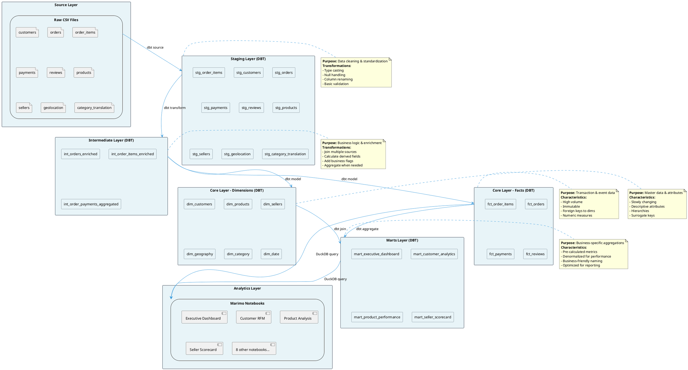

# Olist Data Warehouse - Star Schema

**Last Updated:** 2025-11-11
**Architecture:** Kimball Dimensional Model (Star Schema)
**Tool Stack:** DBT + DuckDB

---

## Schema Overview

The Olist data warehouse is built using a star schema design with:
- **6 Dimension Tables** (Customer, Product, Seller, Geography, Category, Date)
- **4 Fact Tables** (Orders, Order Items, Payments, Reviews)
- **4 Mart Tables** (Pre-aggregated business views)

---

## Star Schema Diagram

```plantuml
@startuml Olist_Star_Schema

skinparam linetype ortho
skinparam backgroundColor #FFFFFF
skinparam classBackgroundColor #E8F4F8
skinparam classBorderColor #2C3E50

' Fact Tables
package "Fact Tables" {
  class fct_orders {
    **Primary Keys**
    --
    + order_id : VARCHAR (PK)
    --
    **Foreign Keys**
    --
    + customer_id : VARCHAR (FK)
    + order_date_key : INTEGER (FK)
    --
    **Metrics**
    --
    + total_order_value : DECIMAL
    + total_freight : DECIMAL
    + total_payment_value : DECIMAL
    + item_count : INTEGER
    + days_to_delivery : INTEGER
    + delivery_performance : VARCHAR
    --
    **Flags**
    --
    + is_delivered : BOOLEAN
    + is_canceled : BOOLEAN
    + used_installments : BOOLEAN
    + has_review : BOOLEAN
    + has_comment : BOOLEAN
    --
    **Timestamps**
    --
    + order_purchase_timestamp : TIMESTAMP
    + order_delivered_timestamp : TIMESTAMP
    --
    **Scores**
    --
    + review_score : INTEGER
    + max_installments : INTEGER
  }

  class fct_order_items {
    **Composite Key**
    --
    + order_id : VARCHAR (PK)
    + order_item_id : INTEGER (PK)
    --
    **Foreign Keys**
    --
    + product_id : VARCHAR (FK)
    + seller_id : VARCHAR (FK)
    --
    **Metrics**
    --
    + item_price : DECIMAL
    + freight_value : DECIMAL
    + freight_percentage : DECIMAL
    + days_to_deliver : INTEGER
    --
    **Flags**
    --
    + is_delivered : BOOLEAN
    + is_canceled : BOOLEAN
    + is_on_time_delivery : BOOLEAN
    + is_same_state : BOOLEAN
    + is_same_city : BOOLEAN
    --
    **Product Info**
    --
    + product_category_name : VARCHAR
    + product_category_name_english : VARCHAR
    --
    **Geography**
    --
    + customer_state : VARCHAR
    + customer_zip_code_prefix : VARCHAR
    + seller_state : VARCHAR
    --
    **Timestamps**
    --
    + order_purchase_timestamp : TIMESTAMP
    + shipping_limit_date : TIMESTAMP
  }

  class fct_payments {
    **Composite Key**
    --
    + order_id : VARCHAR (PK)
    + payment_sequential : INTEGER (PK)
    --
    **Metrics**
    --
    + payment_value : DECIMAL
    + payment_installments : INTEGER
    --
    **Payment Info**
    --
    + payment_type : VARCHAR
    --
    **Flags**
    --
    + is_primary_payment : BOOLEAN
    + is_credit_card : BOOLEAN
    + is_boleto : BOOLEAN
    + is_voucher : BOOLEAN
    + is_debit_card : BOOLEAN
    + uses_installments : BOOLEAN
  }

  class fct_reviews {
    **Primary Keys**
    --
    + review_id : VARCHAR (PK)
    + order_id : VARCHAR (FK)
    --
    **Metrics**
    --
    + review_score : INTEGER
    + days_delivery_to_review : INTEGER
    --
    **Flags**
    --
    + is_positive : BOOLEAN (4-5 stars)
    + is_neutral : BOOLEAN (3 stars)
    + is_negative : BOOLEAN (1-2 stars)
    + has_title : BOOLEAN
    + has_comment : BOOLEAN
    --
    **Content**
    --
    + review_comment_title : VARCHAR
    + review_comment_message : VARCHAR
    --
    **Timestamps**
    --
    + review_creation_date : TIMESTAMP
    + review_answer_timestamp : TIMESTAMP
  }
}

' Dimension Tables
package "Dimension Tables" {
  class dim_customers {
    **Primary Key**
    --
    + customer_id : VARCHAR (PK)
    --
    **Attributes**
    --
    + customer_unique_id : VARCHAR
    + customer_zip_code_prefix : VARCHAR
    + customer_city : VARCHAR
    + customer_state : VARCHAR
    + customer_state_clean : VARCHAR
    --
    **Segmentation**
    --
    + customer_segment : VARCHAR
    + days_since_last_order : INTEGER
    --
    **Metadata**
    --
    + dbt_updated_at : TIMESTAMP
  }

  class dim_products {
    **Primary Key**
    --
    + product_id : VARCHAR (PK)
    --
    **Category**
    --
    + product_category_name : VARCHAR
    + product_category_name_english : VARCHAR
    + category_display_name : VARCHAR
    --
    **Dimensions**
    --
    + product_weight_g : INTEGER
    + product_length_cm : INTEGER
    + product_height_cm : INTEGER
    + product_width_cm : INTEGER
    + product_volume_cm3 : DECIMAL
    --
    **Metadata**
    --
    + product_name_lenght : INTEGER
    + product_description_lenght : INTEGER
    + product_photos_qty : INTEGER
    --
    **Classification**
    --
    + product_size_category : VARCHAR
    + product_weight_category : VARCHAR
    + product_completeness_score : DECIMAL
    + product_quality_tier : VARCHAR
    --
    **Timestamps**
    --
    + dbt_updated_at : TIMESTAMP
  }

  class dim_sellers {
    **Primary Key**
    --
    + seller_id : VARCHAR (PK)
    --
    **Location**
    --
    + seller_zip_code_prefix : VARCHAR
    + seller_city : VARCHAR
    + seller_state : VARCHAR
    + seller_state_clean : VARCHAR
    --
    **Performance Metrics**
    --
    + total_orders : INTEGER
    + total_items_sold : INTEGER
    + total_revenue : DECIMAL
    + avg_item_price : DECIMAL
    + total_freight : DECIMAL
    + avg_freight : DECIMAL
    --
    **Quality Metrics**
    --
    + avg_review_score : DECIMAL
    + positive_reviews : INTEGER
    + negative_reviews : INTEGER
    + total_reviews : INTEGER
    + positive_review_rate : DECIMAL
    --
    **Delivery Metrics**
    --
    + avg_delivery_days : DECIMAL
    + on_time_deliveries : INTEGER
    + total_delivered_orders : INTEGER
    + on_time_delivery_rate : DECIMAL
    --
    **Activity**
    --
    + first_sale_date : DATE
    + last_sale_date : DATE
    + days_active : INTEGER
    + unique_products_sold : INTEGER
    --
    **Classification**
    --
    + seller_performance_tier : VARCHAR
    + seller_size_tier : VARCHAR
    --
    **Metadata**
    --
    + dbt_updated_at : TIMESTAMP
  }

  class dim_geography {
    **Primary Key**
    --
    + zip_code_prefix : VARCHAR (PK)
    --
    **Location**
    --
    + city : VARCHAR
    + state : VARCHAR
    + state_code : VARCHAR
    --
    **Coordinates**
    --
    + latitude : DECIMAL
    + longitude : DECIMAL
    --
    **Hierarchy**
    --
    + region : VARCHAR
    + city_size_tier : VARCHAR
    --
    **Metadata**
    --
    + dbt_updated_at : TIMESTAMP
  }

  class dim_category {
    **Primary Key**
    --
    + product_category_name : VARCHAR (PK)
    --
    **Attributes**
    --
    + product_category_name_english : VARCHAR
    + category_display_name : VARCHAR
    --
    **Metrics**
    --
    + total_products : INTEGER
    + total_revenue : DECIMAL
    + total_orders : INTEGER
    + avg_product_price : DECIMAL
    --
    **Classification**
    --
    + category_group : VARCHAR
    + revenue_tier : VARCHAR
    + category_size_tier : VARCHAR
    --
    **Metadata**
    --
    + dbt_updated_at : TIMESTAMP
  }

  class dim_date {
    **Primary Key**
    --
    + date_key : INTEGER (PK, YYYYMMDD)
    --
    **Date Attributes**
    --
    + date_day : DATE
    + year : INTEGER
    + quarter : INTEGER
    + month : INTEGER
    + month_name : VARCHAR
    + year_month : VARCHAR
    + day_of_month : INTEGER
    + day_of_week : INTEGER
    + day_name : VARCHAR
    + week_of_year : INTEGER
    --
    **Flags**
    --
    + is_weekend : BOOLEAN
    + is_month_start : BOOLEAN
    + is_month_end : BOOLEAN
    + is_quarter_start : BOOLEAN
    + is_quarter_end : BOOLEAN
    + is_year_start : BOOLEAN
    + is_year_end : BOOLEAN
    + is_holiday : BOOLEAN
    --
    **Holiday Info**
    --
    + holiday_name : VARCHAR
    --
    **Metadata**
    --
    + dbt_updated_at : TIMESTAMP
  }
}

' Relationships - Facts to Dimensions
fct_orders }o--|| dim_customers : "customer_id"
fct_orders }o--|| dim_date : "order_date_key"

fct_order_items }o--|| fct_orders : "order_id"
fct_order_items }o--|| dim_products : "product_id"
fct_order_items }o--|| dim_sellers : "seller_id"

fct_payments }o--|| fct_orders : "order_id"

fct_reviews }o--|| fct_orders : "order_id"

dim_customers }o--|| dim_geography : "zip_code_prefix"
dim_sellers }o--|| dim_geography : "zip_code_prefix"
dim_products }o--|| dim_category : "product_category_name"

note right of fct_orders
  <b>Grain:</b> One row per order
  <b>Rows:</b> ~99,992
  <b>Period:</b> 2016-09 to 2018-08
end note

note right of fct_order_items
  <b>Grain:</b> One row per order line item
  <b>Rows:</b> ~112,650
  <b>Note:</b> Multiple items per order possible
end note

note right of dim_date
  <b>Type:</b> Calendar dimension
  <b>Coverage:</b> 2016-2019
  <b>Granularity:</b> Daily
end note

@enduml
```

---

## Mart Tables (Pre-Aggregated Views)

```plantuml
@startuml Olist_Marts

skinparam linetype ortho
skinparam backgroundColor #FFFFFF
skinparam classBackgroundColor #FFF4E6
skinparam classBorderColor #E67E22

package "Mart Layer - Business Views" {
  class mart_executive_dashboard {
    **Grain:** Daily metrics
    --
    **Date Attributes**
    --
    + date_day : DATE (PK)
    + year : INTEGER
    + quarter : INTEGER
    + month_name : VARCHAR
    + year_month : VARCHAR
    + day_name : VARCHAR
    + is_weekend : BOOLEAN
    + is_holiday : BOOLEAN
    --
    **Order Metrics**
    --
    + total_orders : INTEGER
    + delivered_orders : INTEGER
    + canceled_orders : INTEGER
    + unique_customers : INTEGER
    + total_items : INTEGER
    + avg_items_per_order : DECIMAL
    --
    **Revenue Metrics**
    --
    + total_revenue : DECIMAL
    + total_freight : DECIMAL
    + total_payments : DECIMAL
    + avg_order_value : DECIMAL
    + revenue_per_customer : DECIMAL
    --
    **Review Metrics**
    --
    + total_reviews : INTEGER
    + avg_review_score : DECIMAL
    + positive_reviews : INTEGER
    + negative_reviews : INTEGER
    + positive_review_rate : DECIMAL
    --
    **Delivery Metrics**
    --
    + avg_delivery_days : DECIMAL
    + on_time_deliveries : INTEGER
    + on_time_delivery_rate : DECIMAL
    --
    **Payment Metrics**
    --
    + credit_card_orders : INTEGER
    + boleto_orders : INTEGER
    + installment_orders : INTEGER
    + installment_usage_rate : DECIMAL
    --
    **Calculated Rates**
    --
    + delivery_rate : DECIMAL
    + cancellation_rate : DECIMAL
    --
    **Moving Averages**
    --
    + ma7_orders : DECIMAL
    + ma7_revenue : DECIMAL
    + ma7_review_score : DECIMAL
    + ma30_orders : DECIMAL
    + ma30_revenue : DECIMAL
    --
    **Running Totals**
    --
    + ytd_revenue : DECIMAL
    + ytd_orders : INTEGER
  }

  class mart_customer_analytics {
    **Grain:** One row per customer
    --
    **Identifiers**
    --
    + customer_id : VARCHAR (PK)
    + customer_unique_id : VARCHAR
    --
    **Location**
    --
    + customer_state : VARCHAR
    + region : VARCHAR
    + city_size_tier : VARCHAR
    --
    **Order Metrics**
    --
    + total_orders : INTEGER
    + delivered_orders : INTEGER
    + canceled_orders : INTEGER
    + first_order_date : DATE
    + last_order_date : DATE
    --
    **Financial Metrics**
    --
    + lifetime_value : DECIMAL
    + avg_order_value : DECIMAL
    + total_items : INTEGER
    + total_freight : DECIMAL
    --
    **RFM Metrics**
    --
    + recency_days : INTEGER
    + frequency : INTEGER
    + monetary_value : DECIMAL
    + recency_score : INTEGER (1-5)
    + frequency_score : INTEGER (1-5)
    + monetary_score : INTEGER (1-5)
    + rfm_total_score : INTEGER
    --
    **RFM Segmentation**
    --
    + rfm_segment : VARCHAR
    .. Champions, Loyal, At Risk, Lost, etc.
    --
    **Lifecycle**
    --
    + lifecycle_stage : VARCHAR
    .. Active, Cooling, At Risk, Dormant
    + value_tier : VARCHAR
    .. VIP, High, Medium, Low
    --
    **Behavior Metrics**
    --
    + avg_days_between_orders : DECIMAL
    + installment_orders : INTEGER
    + avg_review_score : DECIMAL
    + orders_with_comments : INTEGER
    --
    **Product Preferences**
    --
    + unique_products_purchased : INTEGER
    + unique_categories_purchased : INTEGER
    + favorite_category : VARCHAR
    --
    **Delivery Experience**
    --
    + avg_delivery_days : DECIMAL
    + on_time_deliveries : INTEGER
    + on_time_delivery_rate : DECIMAL
  }

  class mart_product_performance {
    **Grain:** One row per product
    --
    **Identifiers**
    --
    + product_id : VARCHAR (PK)
    + product_category_name_english : VARCHAR
    + category_display_name : VARCHAR
    --
    **Category Context**
    --
    + category_group : VARCHAR
    + category_revenue_tier : VARCHAR
    + category_size_tier : VARCHAR
    --
    **Product Attributes**
    --
    + product_weight_g : INTEGER
    + product_volume_cm3 : DECIMAL
    + product_size_category : VARCHAR
    + product_weight_category : VARCHAR
    + product_quality_tier : VARCHAR
    --
    **Sales Metrics**
    --
    + total_orders : INTEGER
    + total_units_sold : INTEGER
    + total_revenue : DECIMAL
    + avg_price : DECIMAL
    + min_price : DECIMAL
    + max_price : DECIMAL
    --
    **Freight Metrics**
    --
    + total_freight : DECIMAL
    + avg_freight : DECIMAL
    + avg_freight_percentage : DECIMAL
    --
    **Date Metrics**
    --
    + first_sale_date : DATE
    + last_sale_date : DATE
    + days_on_sale : INTEGER
    --
    **Delivery Metrics**
    --
    + delivered_orders : INTEGER
    + canceled_orders : INTEGER
    + on_time_deliveries : INTEGER
    + delivery_rate : DECIMAL
    + cancellation_rate : DECIMAL
    + on_time_delivery_rate : DECIMAL
    + avg_delivery_days : DECIMAL
    --
    **Review Metrics**
    --
    + total_reviews : INTEGER
    + avg_review_score : DECIMAL
    + positive_reviews : INTEGER
    + negative_reviews : INTEGER
    + positive_review_rate : DECIMAL
    + reviews_with_comments : INTEGER
    --
    **Geographic Reach**
    --
    + unique_customer_locations : INTEGER
    + unique_customer_states : INTEGER
    + top_customer_state : VARCHAR
    + same_state_sales : INTEGER
    + same_state_sales_rate : DECIMAL
    --
    **Seller Metrics**
    --
    + unique_sellers : INTEGER
    + primary_seller_id : VARCHAR
    --
    **Performance Tiers**
    --
    + sales_tier : VARCHAR
    .. Best Seller, Top, Good, Low
    + review_tier : VARCHAR
    .. Excellent, Very Good, Good, etc.
    + performance_score : DECIMAL
    --
    **Revenue Efficiency**
    --
    + revenue_per_unit : DECIMAL
  }

  class mart_seller_scorecard {
    **Grain:** One row per seller
    --
    **Identifiers**
    --
    + seller_id : VARCHAR (PK)
    --
    **Location**
    --
    + seller_state : VARCHAR
    + region : VARCHAR
    + city_size_tier : VARCHAR
    --
    **Performance Tiers**
    --
    + seller_performance_tier : VARCHAR
    + seller_size_tier : VARCHAR
    --
    **Sales Metrics**
    --
    + total_orders : INTEGER
    + total_items_sold : INTEGER
    + total_revenue : DECIMAL
    + avg_item_price : DECIMAL
    + total_freight : DECIMAL
    --
    **Time Metrics**
    --
    + first_sale_date : DATE
    + last_sale_date : DATE
    + days_active : INTEGER
    + active_months : INTEGER
    --
    **Recent Activity**
    --
    + orders_last_30_days : INTEGER
    + orders_last_90_days : INTEGER
    + orders_last_180_days : INTEGER
    + activity_status : VARCHAR
    .. Active (30d), Recent (90d), etc.
    --
    **Product Diversity**
    --
    + unique_products_sold : INTEGER
    + unique_categories : INTEGER
    + top_category : VARCHAR
    + product_diversity_type : VARCHAR
    .. Specialist, Focused, Diverse, Generalist
    --
    **Price Metrics**
    --
    + avg_product_price : DECIMAL
    + min_product_price : DECIMAL
    + max_product_price : DECIMAL
    + price_stddev : DECIMAL
    + avg_freight_percentage : DECIMAL
    --
    **Geographic Reach**
    --
    + unique_customer_locations : INTEGER
    + unique_customer_states : INTEGER
    + top_customer_state : VARCHAR
    + same_state_orders : INTEGER
    + same_state_order_rate : DECIMAL
    + geographic_focus : VARCHAR
    .. Local Focused, Regional, National
    --
    **Review Metrics**
    --
    + avg_review_score : DECIMAL
    + positive_reviews : INTEGER
    + negative_reviews : INTEGER
    + total_reviews : INTEGER
    + positive_review_rate : DECIMAL
    --
    **Delivery Metrics**
    --
    + avg_delivery_days : DECIMAL
    + on_time_deliveries : INTEGER
    + total_delivered_orders : INTEGER
    + on_time_delivery_rate : DECIMAL
    --
    **Revenue Efficiency**
    --
    + revenue_per_item : DECIMAL
    + revenue_per_order : DECIMAL
    + revenue_per_day_active : DECIMAL
    + revenue_per_month : DECIMAL
    --
    **Performance Scores**
    --
    + revenue_percentile : DECIMAL (0-100)
    + review_score_100 : DECIMAL (0-100)
    + delivery_score_100 : DECIMAL (0-100)
    + overall_performance_score : DECIMAL
    --
    **Health Indicators**
    --
    + seller_health : VARCHAR
    .. Excellent, Good, Average, Needs Improvement
  }
}

note right of mart_executive_dashboard
  <b>Purpose:</b> Daily KPI dashboard
  <b>Refresh:</b> Daily batch
  <b>Users:</b> Executives, Leadership
end note

note right of mart_customer_analytics
  <b>Purpose:</b> RFM & customer lifecycle
  <b>Refresh:</b> Weekly batch
  <b>Users:</b> Marketing, CRM teams
end note

note right of mart_product_performance
  <b>Purpose:</b> Product & category analysis
  <b>Refresh:</b> Daily batch
  <b>Users:</b> Product managers, Buyers
end note

note right of mart_seller_scorecard
  <b>Purpose:</b> Seller performance tracking
  <b>Refresh:</b> Daily batch
  <b>Users:</b> Marketplace ops, Seller relations
end note

@enduml
```

---

## Data Flow Architecture

---

## Key Design Decisions

### 1. Star Schema Benefits
- **Simple queries** - Easy joins for analysts
- **Fast aggregations** - Pre-calculated dimensions
- **Business alignment** - Matches how business thinks
- **Scalable** - Can add new facts/dimensions easily

### 2. Grain Definitions
- **fct_orders** - One row per order (order-level metrics)
- **fct_order_items** - One row per order line item (product-level detail)
- **fct_payments** - One row per payment transaction (payment-level)
- **fct_reviews** - One row per review (review-level)

### 3. Dimension Hierarchies
- **Geography** - Zip → City → State → Region
- **Date** - Day → Week → Month → Quarter → Year
- **Category** - Category → Category Group
- **Product** - Product → Category → Category Group

### 4. Denormalization Strategy
- Fact tables include commonly used dimension attributes (e.g., product_category_name_english in fct_order_items)
- Reduces join complexity for common queries
- Trade-off: Storage space vs query performance

### 5. Pre-Aggregated Marts
- **Purpose:** Avoid expensive aggregations at query time
- **Trade-off:** Slightly stale data (daily/weekly batch) vs real-time
- **Benefit:** Consistent business logic, validated metrics

---

## Schema Statistics

| Layer | Tables | Approx Rows | Purpose |
|-------|--------|-------------|---------|
| **Staging** | 9 | 1.4M total | Clean raw data |
| **Intermediate** | 3 | ~300K | Enriched joins |
| **Dimensions** | 6 | ~135K | Master data |
| **Facts** | 4 | ~315K | Transactions |
| **Marts** | 4 | ~132K | Business views |

---

## Usage Recommendations

### For Ad-Hoc Analysis
✅ Use **Fact tables** + **Dimension tables**
- Full flexibility
- Can create custom aggregations
- Access to all detail

### For Standard Reporting
✅ Use **Mart tables**
- Pre-calculated metrics
- Faster performance
- Consistent definitions

### For Dashboards
✅ Use **Mart tables** primarily
- Optimized for visualization tools
- Stable schema
- Business-friendly column names

---

**Schema Version:** 1.0
**Last Updated:** 2025-11-11
**Maintained By:** DBT transformations
**Documentation:** See individual model files in `dbt/olist_dw_dbt/models/`
